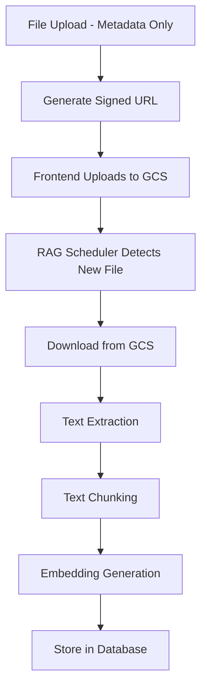

# RAG (Retrieval-Augmented Generation) System

## Overview

The RAG system processes educational documents through a pipeline:
1. **File Upload** - Documents are uploaded via metadata-only endpoints
2. **Text Extraction** - Content is extracted from documents
3. **Chunking** - Text is split into manageable chunks
4. **Embedding** - Chunks are converted to vector embeddings
5. **Storage** - Embeddings are stored in the database
6. **Retrieval** - Similarity search for relevant content

## File Upload Flow (Updated)

Instead of sending file content to the backend, the frontend now:
1. Sends metadata (file name, size, type, and other required fields) to the backend
2. Receives signed URLs from the backend
3. Uploads files directly to Google Cloud Storage (GCS)
4. The backend automatically processes files for RAG after they're uploaded to GCS

This improves performance and reduces backend load.

## Components

### 1. File Handlers
- `rag_file_handler.py` - Handles RAG-specific file uploads
- `curri_file_handler.py` - Handles curriculum file uploads
- `sem_file_handler.py` - Handles semester plan file uploads

### 2. Background Processing
- `schedule_rag_processing.py` - Monitors uploads and schedules processing
- `text_processing.py` - Text extraction and chunking tasks
- `embedding_processing.py` - Embedding generation tasks
- `enqueue_text_chunking.py` - Task queuing utilities

### 3. Utilities
- `gcs_utils.py` - Google Cloud Storage integration
- `embedding.py` - Embedding model integration (Gemini)

## Processing Pipeline



## API Endpoints

### RAG Upload
```
POST /api/teacher/rag/upload
```
Accepts metadata only (file_name, file_size, file_type, etc.)

### Curriculum Upload
```
POST /api/teacher/curriculum/upload
```
Accepts metadata only with education system/level fields

### Semester Plan Upload
```
POST /api/teacher/sem-plan/upload
```
Accepts metadata only with education system/level fields

## Background Processing

The system uses ARQ workers for asynchronous processing:
- Text chunking workers (2 queues for load balancing)
- Embedding workers
- Scheduler that monitors KnowledgeMetadata entries

Files are processed 120 seconds after upload to allow for GCS consistency.

## Testing

Run tests with:
```
python -m pytest rag/test_*.py
```

See `test_metadata_upload.py` for examples of the new metadata-only upload flow.